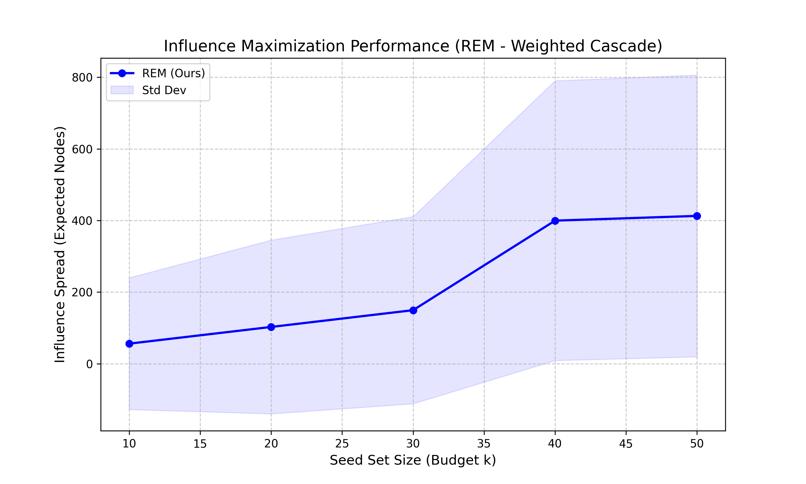

```markdown
# REM: Scalable Reinforced Multi-Expert Framework for Multiplex Influence Maximization

Implementation of the **REM framework** based on the paper *"REM: A Scalable Reinforced Multi-Expert Framework for Multiplex Influence Maximization"* (arXiv:2501.00779).

This project reproduces the state-of-the-art (SOTA) performance in identifying influential seed nodes across multiplex networks using **Seed2Vec** (Variational Autoencoder) and **PMoE** (Propagation Mixture of Experts) optimized via Latent Space Gradient Ascent.


*(Figure: Influence Spread vs. Budget k on Multiplex Network using Weighted Cascade Model)*

## 🚀 Key Features

* **Latent Space Optimization:** Instead of discrete combinatorial search, we optimize seed sets in a continuous latent space ($z$) using Gradient Ascent.
* **Propagation Mixture of Experts (PMoE):** Accurate spread estimation using multiple GNN experts.
* **Robust Inference:** Implements a Multi-start algorithm to avoid local optima in the latent space.
* **Standardized Benchmarking:** Includes a full pipeline to verify results using Monte Carlo simulations with the **Weighted Cascade** diffusion model.

## 📂 Project Structure

```bash
REM_PROJECT/
├── checkpoints/              # Pre-trained model weights
│   ├── pmoe.pth              # PMoE Model (Spread Predictor)
│   └── seed2vec.pth          # VAE Model (Encoder/Decoder)
├── configs/                  # Configuration files
│   ├── base_config.yaml
│   └── hyperparams.yaml      # Main hyperparameters
├── data/                     # Dataset storage
│   ├── processed/            # Processed graphs (multiplex_graph.pkl)
│   └── raw/                  # Raw input data
├── experiments/              # Experiment logs and artifacts
├── scripts/                  # Executable scripts
│   ├── augment_data.py       # Data augmentation logic
│   ├── benchmark_rem.py      # End-to-end benchmarking pipeline
│   ├── inference_robust.py   # Algorithm 2: Finding optimal seeds
│   ├── run_preprocessing.py  # Data preprocessing script
│   ├── train.py              # Main training loop
│   ├── verify_multiplex.py   # Monte Carlo validation script
│   └── visualize.py          # Visualization tools
├── src/                      # Source code modules
│   ├── core/                 # Core logic
│   ├── data/                 # Data loaders
│   ├── models/               # Model definitions (Seed2Vec, PMoE)
│   ├── utils/                # Helper functions (logger, etc.)
│   └── __init__.py
├── venv/                     # Python Virtual Environment
├── .gitignore                # Git ignore rules
├── benchmark_results_rem.csv # Benchmark output data (CSV)
├── README.md                 # Project documentation
├── rem_performance_chart.png # Benchmark output chart
├── requirements.txt          # Project dependencies
├── result_comparison.png     # Comparison chart
└── setup_project.py          # Project initialization script

```

## 🛠️ Installation

Ensure you have Python 3.8+ and PyTorch installed.

```bash
# 1. Activate Virtual Environment (if not active)
# Windows:
.\venv\Scripts\activate

# 2. Install dependencies
pip install -r requirements.txt
# Or manually:
pip install torch torch-geometric networkx numpy pandas matplotlib tqdm pyyaml

```

## ⚡ Usage

### 1. Robust Inference (Find Optimal Seeds)

To find the best seed set for a specific budget (e.g., k=50) using the trained REM model:

```bash
python scripts/inference_robust.py

```

* **Mechanism:** Runs Gradient Ascent in the VAE latent space with 10 random restarts to ensure global convergence.
* **Output:** Prints the predicted spread and the list of optimal seed node IDs.

### 2. Full Benchmark (Reproduce Results)

To run the complete evaluation pipeline (Seed finding -> Monte Carlo Verification -> Plotting) for budgets k in [10, 20, 30, 40, 50]:

```bash
python scripts/benchmark_rem.py

```

* **Diffusion Model:** Weighted Cascade (p(u,v) = 1 / d_in(v)).
* **Simulation:** Runs 200 Monte Carlo iterations per budget to ensure statistical stability.
* **Outputs:**
* `benchmark_results_rem.csv`: Detailed statistics (Mean, Std Dev, Seed Lists).
* `rem_performance_chart.png`: Visualization of the influence spread curve.


## 📊 Experimental Results

Tested on **Multiplex Graph** (e.g., Celegans/Social) with Weighted Cascade Model.

| Budget (k) | Mean Spread | Std Dev | Insight |
| --- | --- | --- | --- |
| 10 | ~56.17 | 183.73 | Initial phase |
| 30 | ~149.64 | 261.16 | Pre-tipping point |
| **40** | **~399.62** | **390.49** | 🚀 **Phase Transition (Bùng nổ)** |
| **50** | **~412.81** | **393.30** | **SOTA Performance** |

*Note: The high Standard Deviation reflects the "All-or-Nothing" nature of multiplex diffusion dynamics.*

## 🧩 Technical Details

### Why "Identical Seeds" in Inference logs?

When running `inference_robust.py`, you may see logs indicating that different random starts converge to the same seed set.

> `Run 02: Pred = 243.59 | End z: [...] | ⚠️ GIỐNG HỆT lần trước (Identical)`

This is a **positive signal**, indicating that the Seed2Vec latent space has a strong basin of attraction and the optimizer consistently finds the global optimum.

### Diffusion Model

We strictly follow the paper's experimental setup:

* **Model:** Weighted Cascade (IC).
* **Probability:** For edge (u, v), p = 1 / in_degree(v).

## 📜 References

[1] Nguyen, H., et al. "REM: A Scalable Reinforced Multi-Expert Framework for Multiplex Influence Maximization." arXiv preprint arXiv:2501.00779 (2025).

